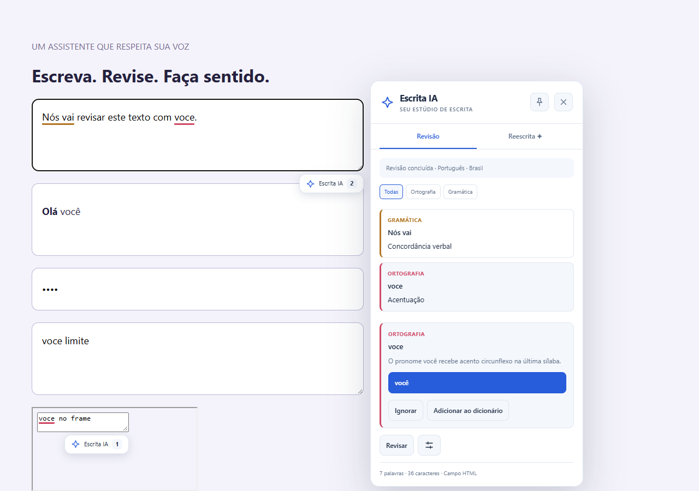

# Escrita IA

[](https://github.com/Junio243/escrita-ia/actions/workflows/ci.yml)


Extensão para Google Chrome que revisa ortografia, gramática, pontuação, estilo e tom diretamente nos campos de texto do navegador. As ocorrências são grifadas durante a digitação e nenhuma alteração é aplicada sem o clique do usuário.

## Extensão 3.0 — Estúdio de escrita

Esta versão muda a extensão instalada no Chrome: painel, popup e configurações.

- Painel com abas **Revisão** e **Reescrita**, filtros por categoria, indicador compacto e opção de fixar o painel no canto da tela.
- Grifos abrem sugestões por clique; passar o mouse não abre mais o painel. `Esc` fecha a revisão.
- **Aplicar correções locais** reúne ajustes não sobrepostos em uma alteração reversível. Revisões por IA continuam sendo aplicadas individualmente.
- Reescrita de seleção ou **Usar campo inteiro**, com até 6.000 caracteres. Gerar novamente substitui as alternativas anteriores.
- Popup com pausa global, controle por site e estatísticas da sessão. Configuração preenchida não é apresentada como conexão testada.
- Configurações organizadas por seção, predefinições de provedor e exibição opcional apenas da chave digitada. A chave armazenada nunca é preenchida no formulário.



[Popup](docs/screenshots/extension-popup.png) · [Configurações](docs/screenshots/extension-settings.png) · [Reescrita](docs/screenshots/extension-rewrite.png)

**Atualizar a extensão instalada:** substitua os arquivos na pasta que você já carregou, abra `chrome://extensions`, clique em **Recarregar** na Escrita IA e atualize as abas em que vai escrever. Atualizar apenas o site do GitHub Pages não atualiza a extensão. Evite instalar duas cópias ao mesmo tempo.

**[Abrir demonstração interativa](https://Junio243.github.io/escrita-ia/)** · [Baixar extensão](https://github.com/Junio243/escrita-ia/archive/refs/heads/main.zip)

O novo **Estúdio de escrita** tem exemplos de ideia, e-mail, trabalho e redes sociais, tema claro/escuro, modo foco (saída com `Esc`), contagem de palavras, estimativa de leitura e cópia do texto. Ao trocar um exemplo, **Desfazer** recupera o rascunho anterior. Apenas a preferência de tema é salva; o texto não persiste ao recarregar a página.

A apresentação prioriza o editor, com painel lateral, destaques diretamente no texto e filtros por repetições ou espaços duplicados. **Ver no texto** seleciona a ocorrência; **Limpar texto** permite recomeçar e recuperar o conteúdo com **Desfazer**. A organização visual tem como referência o [LanguageTool](https://languagetool.org/pt-BR), com identidade, implementação e regras próprias da Escrita IA.

[](https://Junio243.github.io/escrita-ia/)

[Visualizar tema escuro](docs/screenshots/demo-dark.png) · [Visualizar no celular](docs/screenshots/demo-mobile.png)

## Recursos

Na versão 3.0.3, use **Aplicar correção** junto da sugestão ou **Aplicar esta versão** em uma reescrita para alterar o campo da página. A confirmação permanece visível durante a nova revisão. **Buscar sugestões** apenas executa a análise. Também foi corrigido um erro ao posicionar o painel abaixo de campos largos ou em telas estreitas.

- Análise automática após 400 ms sem digitação.
- Correções de ortografia, gramática, pontuação e tipografia.
- Sugestões de estilo, tom, redundância e concisão.
- Reescrita clara, concisa, formal, fluida ou persuasiva.
- Aplicação de cada sugestão com um clique e opção de desfazer.
- Atalho `Alt+Shift+E` para abrir/fechar o painel no campo ativo.
- Estatísticas da sessão (análises, ocorrências, sugestões aplicadas) no diagnóstico.
- Regra local de palavra duplicada, sem depender da IA.
- Dicionário pessoal separado por idioma.
- Modo Exigente para revisão estilística mais rigorosa.
- Contadores de palavras e caracteres dentro do campo.
- Temas claro e escuro.
- 36 variantes em 34 idiomas.
- Adaptadores para campos e editores usados por ChatGPT, Instagram, Facebook, LinkedIn e X.

## Provedores de IA

### Google AI Studio / Gemini (3.0.1)

Nas configurações, clique em **Google AI Studio**, informe a chave no campo próprio e o identificador exato do modelo disponível na sua conta. Use **Salvar e testar conexão**.

- URL: `https://generativelanguage.googleapis.com/v1beta/openai/`
- Formato: **Chat Completions** (também selecionado automaticamente para esse domínio).
- Modelo: o nome do modelo Gemini no AI Studio, não um identificador `gpt-*`.

A versão 3.0.1 corrige a tentativa indevida de Responses no Google e distingue erros de modelo, chave, permissão e cota. [Documentação oficial](https://ai.google.dev/gemini-api/docs/openai).

A extensão aceita serviços compatíveis com a API da OpenAI. A configuração possui:

- URL da API;
- chave da API com qualquer formato;
- nome exato do modelo;
- Responses API, Chat Completions ou detecção automática.

O botão de revisão pode ser arrastado com o mouse e mantém a posição escolhida. O teste de conexão mostra cada etapa e só confirma sucesso após uma resposta válida do modelo. Quando um formato de resposta funciona, a extensão o prioriza nas próximas solicitações para evitar tentativas desnecessárias. APIs nativas com contratos diferentes dos formatos acima ainda exigem adaptadores próprios.

Servidores locais em `localhost`, `127.0.0.1` e `[::1]` podem funcionar sem chave. Cada credencial é vinculada à URL em que foi cadastrada para impedir seu envio acidental a outro provedor.

## Instalação no Chrome

1. Baixe ou clone este repositório.
2. Abra `chrome://extensions`.
3. Ative o **Modo do desenvolvedor**.
4. Clique em **Carregar sem compactação**.
5. Selecione a pasta que contém o arquivo `manifest.json`.
6. Em **Detalhes → Acesso ao site**, permita o acesso aos sites desejados.
7. Abra as configurações da extensão, informe o provedor e clique em **Salvar e testar conexão**.

Para atualizar uma instalação existente, substitua os arquivos, clique em **Recarregar** no cartão da extensão e atualize as páginas abertas.

## Desenvolvimento e testes

Requer Node.js para executar os testes locais:

```bash
npm test
```

Para construir e testar a demonstração em navegador:

```bash
npm ci
npx playwright install chromium
npm run build:site
npm run test:site
```

O site está em `site/`; o build copia o motor real de regras locais (`engine.js`) e os ícones para `dist-site/`. Os testes usam um servidor temporário no caminho `/escrita-ia/`, verificam aplicação e desfazer, edição manual, texto vazio, Unicode, conteúdo HTML, navegação por teclado e layouts entre 320 e 1440 px. Não há chamadas de IA na demonstração.

Para o teste da extensão real, execute `npm run test:browser`. Ele usa Chrome instalado em `C:/Program Files/Google/Chrome/Application/chrome.exe`; configure `CHROME_PATH` para outro caminho. As respostas da IA são simuladas e o perfil de teste fica em `work/`, ignorado pelo Git.

### Publicação no GitHub Pages

O workflow `Deploy GitHub Pages` executa os testes, constrói apenas o site e publica a demonstração após alterações em `main`. O repositório deve ter **Settings → Pages → Source → GitHub Actions** habilitado. Pull requests passam pelo CI sem publicar. Veja a [documentação oficial dos workflows do Pages](https://docs.github.com/en/pages/getting-started-with-github-pages/using-custom-workflows-with-github-pages).

A suíte cobre análise, reescrita, Unicode, dicionário, cache, cancelamento, segurança de credenciais, atalho de teclado, estatísticas da sessão e os transportes Responses e Chat Completions. O teste de navegador em `tests/browser.cjs` usa Playwright e carrega a extensão real em um perfil isolado do Chrome.

## Demonstração

Experimente as regras de palavras e espaços duplicados na [demonstração pública](https://Junio243.github.io/escrita-ia/). A página explica a instalação e permite aplicar sugestões e desfazer a última alteração. A revisão completa por IA requer a extensão e um provedor configurado.

Extensão real no Chrome, com respostas de IA simuladas no teste de integração:


## Arquivos importantes

- `manifest.json`: manifesto Manifest V3.
- `background.js`: serviço de fundo e comunicação com provedores.
- `content.js`: detecção e acompanhamento dos campos.
- `fields.js`: adaptadores para campos simples e editores ricos.
- `panel.js`: interface, grifos e sugestões.
- `provider.js`: compatibilidade com Responses e Chat Completions.
- `options.html`: configurações do provedor, idiomas, tema e dicionário.
- `LEIA-ME.md`: manual detalhado de instalação e uso.
- `VALIDACAO.md`: relatório dos testes executados e limitações conhecidas.

## Privacidade

Somente o conteúdo do campo em revisão é enviado à URL configurada. A extensão não publica mensagens e não mantém histórico persistente dos textos. A chave fica no armazenamento local ou de sessão do perfil do Chrome e não é exposta aos scripts das páginas.

As regras de retenção, privacidade e cobrança dependem do provedor escolhido. Páginas internas do Chrome, Chrome Web Store, Google Docs em canvas e áreas protegidas podem impedir a integração.

## Versão

Versão atual: **3.0.3**.

Consulte [LEIA-ME.md](LEIA-ME.md) para instruções completas e [VALIDACAO.md](VALIDACAO.md) para os resultados de validação.
